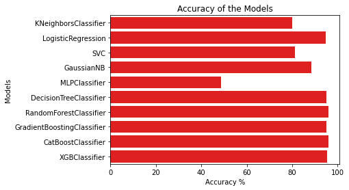
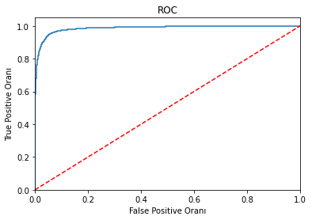
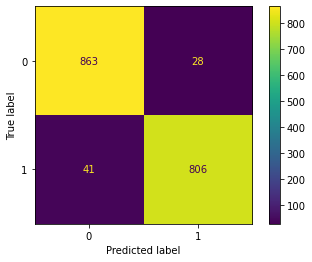
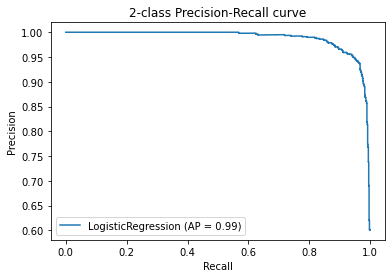

# Term Deposit Marketing Data Analysis

## Summary 

Data analysis for predicting if the customer will subscribe to a term deposit. This project has developed for Data Science company technical interview. 

## How to improve the result?

I did not tuned hyper-parameters, so before the learning process you can make hyper-parameter tuning for better result.

## Background

ACME is a small startup focusing mainly on providing machine learning solutions in the European banking market. We work on a variety of problems including fraud detection, sentiment classification and customer intention prediction and classification.

We are interested in developing a robust machine learning system that leverages information coming from call center data.

Ultimately, at ACME we are looking to improve the success rate for calls made to customers for any product that our clients offer. Towards this goal we are working on designing an ever evolving machine learning product that offers high success outcomes while offering interpretability for our clients to make informed decisions.

## Data Description

The data comes from direct marketing efforts of a European banking institution. The marketing campaign involves making a phone call to a customer, often multiple times to ensure a product subscription, in this case a term deposit. Term deposits are usually short-term deposits with maturities ranging from one month to a few years. The customer must understand when buying a term deposit that they can withdraw their funds only after the term ends. All customer information that might reveal personal information is removed due to privacy concerns.

## Attributes

**age** : age of customer (numeric)

**job** : type of job (categorical)

**marital** : marital status (categorical)

**education** (categorical)

**default**: has credit in default? (binary)

**balance**: average yearly balance, in euros (numeric)

**housing**: has a housing loan? (binary)

**loan**: has personal loan? (binary)

**contact**: contact communication type (categorical)

**day**: last contact day of the month (numeric)

**month**: last contact month of year (categorical)

**duration**: last contact duration, in seconds (numeric)

**campaign**: number of contacts performed during this campaign and for this client (numeric, includes last contact)

### Output (desired target):

**y** - has the client subscribed to a term deposit? (binary)

## Goal(s)

* Predict if the customer will subscribe (yes/no) to a term deposit (variable y)

## Success Metric(s)

* Hit %81 or above accuracy by evaluating with 5-fold cross validation and reporting the average performance score.

## Bonus(es)

* We are also interested in finding customers who are more likely to buy the investment product. Determine the segment(s) of customers our client should prioritize.

* What makes the customers buy? Tell us which feature we should be focusing more on.

## Results

| Models                     | Cross Validation Score |
|----------------------------|------------------------|
| CatBoostClassifier         | 96.029919              |
| RandomForestClassifier     | 95.914845              |
| XGBClassifier              | 95.454545              |
| DecisionTreeClassifier     | 95.109321              |
| GradientBoostingClassifier | 95.051784              |
| LogisticRegression         | 94.879171              |
| GaussianNB                 | 88.550058              |
| SVC                        | 81.185270              |
| KNeighborsClassifier       | 80.092060              |
| MLPClassifier              | 48.734177              |

### CatBoost Classifier Result

| Metrics                   | Score |
|---------------------------|-------|
| Accuracy                  | 0.960 |
| Precision                 | 0.966 |
| Recall                    | 0.952 |
| F1-Score                  | 0.960 |
| 10-Fold Cross Validation  | 0.954 |
